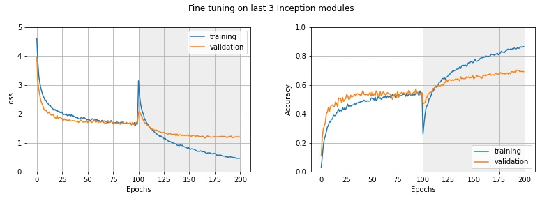
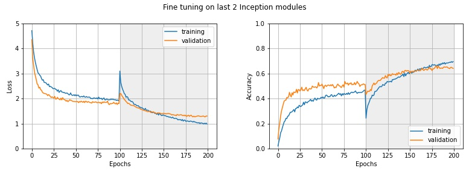
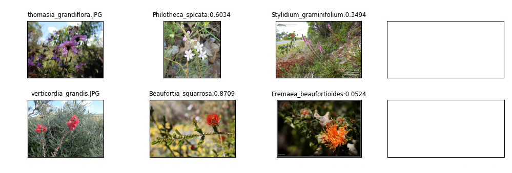

# Australian Wildflower Classification Model

## Overview
I trained a Deep Neural Network Model which classifies images of 108 Australian Wild Flowers by using transfer learning method. The base model I used is InceptionV3, to which some combination of fully connected layers and the output layer tailored for this classification task are attached.

After simple transfer-learning, I performed fine-tuning so the model further adapts to this task. In fine-tuning step, I examined some variations of how many inception blocks to be fine-tuned and compared them.

Things I leaned through this project is:
- Collecting image data, convert image data format, resize, and sort into train/validation/test data.
- InceptionV3 Architecture and how to see the layer names in a base model (this is necessary to determine how deep I am going to fine tune).
- How to stop the randomness in training of Deep Learning models.

## Goal

I would like to make an app that can detect the variety(species) of the wildflower in the photo a user took. In my private time, I like going for hiking, camping, and bush walking in nature in Western Australia, and when I do I often find beautiful wildflowers. Australia is well known for its unique natural environment, and especially Western Australia is famous worldwide about its huge variety of unique native wildflowers. I got an idea that it would be more fun if people are able to know what kind of wildflower they found in the nature from the photo they took, by using my app!  

## Data

Firstly, I listed up the varieties of Australian wildflowers from a book* and websites\*\*.

- \* A Guide to 101 Wildflowers of Western Australia (published by Perenjori Community Resource Center)

- ** https://www.bhg.com.au/australian-native-flowers-a-guide-to-australian-flowers

- ** https://medium.com/the-philipendium/25-beautiful-australian-wildflowers-f248d6f1db1

Then I created image dataset by collecting photos of flowers I listed up. Images were collected mainly on google image search by searching the scientific name of the flower (however, it was case-by-case). Image collection was one of the hardest part of this project. For some species, I managed to find just a few relevant images online, which was far from enough to train Deep Learning models. I just threw away those species from this project, or merged into genus which is often more familiar to people. In other cases, some species looked so similar to others to an untrained eye that it was hard for me to make sure that the downloaded image was surely relevant to the intended class. I realised categorising flowers demands more experience and skills than I imagined. (I would need a specialist to do this if I made a scientific purpose app)

Apart from google image search, there were some great database and websites regarding Australian wildflower images which I relied on throughout this project. I would like to list them up here:
- [GBIF | Global Biodiversity Information Facility](https://www.gbif.org)
- [iNaturalist AU](https://inaturalist.ala.org.au/)
- [Florabase](https://florabase.dpaw.wa.gov.au/)
- [Dave's Garden](https://davesgarden.com/)
- [Esperance Wildflowers](http://esperancewildflowers.blogspot.com/)
- [EXPLOREOZ](https://www.exploroz.com/wildflowers)

Finally, I collected a total of 6019 images of 108 Australian wildflowers. There were from 32 to 82 images in each flower category. I trimmed, converted to JPG, and resized images by hand and by Python script. I divided those into train/validation/test data sets randomly in the ratio approx. 8/1/1.

**Some examples in my dataset:**

As a supporting material, I included a folder(`flower_categories/`) in the repository, which has the example photos of 108 flowers. There is one image for each category, and its file name represents the (scientific or common) name of the wildflower.

## Architecture

In this project, I applied transfer learning on my model. I used InceptionV3 model that is pre-trained on ImageNet as a base model without the top layer. I attached one Global Average Pooling layer to it, which converts the dimensionality of the output from the base model from 3 to 1, followed by 2 dense layers with ReLU activation function. The final layer is the output layer that outputs propbabilities corresponding to the 108 classes. The output layer is activated by softmax function.

To prevent overfitting, I added dropout layers between layers I mentioned above. Also I set `kernel_regularizer` parameter to apply L2 regularization.

## Training

Firstly, the model was trained with the pretrained layers being set to be untrainable so the base model fully preserved the weights it had gained previously. This is the common method of transfer learning. After training 100 epochs, I set the parameter of pretrained layers so that (a part of) the base model was trained with my data, and trained further 100 epochs. This method is called fine-tuning.

At the end of each epoch, validation loss and validation accuracy was calculated. I was able to see the progress in training by observing validation loss/accuracy as well as training loss/accuracy.

### Fine tune

In fine-tuning, I compared the performances between models which have different depth of layers being fine-tuned; full layers in base model (Model A), last 5 Inception modules(Model B), last 3 inception modules(Model C), and last 2 Inception modules(Model D). The base model already had a remarkable ability to detect general things, and I wanted to make use of it. I wondered how deep I should fine-tune the base model further after training with the base model untrained (this is often called feature extraction).

(The original image was taken from [this page](https://paperswithcode.com/method/inception-v3) and I added blue part about fine-tuned layers.)

I show the learning curves of those models regarding loss and accuracy below. Grey background means the epochs where fine-tuning was performed. For all of those models, fine-tuning worked and it contributed to the improvement of the model's performance. In general, the deeper the layer that are fine-tuned gets, the better the model learns. However, fine-tuning tends to result in overfitting. Differences of the performances between the depth of fine-tuning is going to be further discussed in the future section.   

## Test

In the test, those 4 models predicted the test data, and accuracy was calculated.

I obviously saw that any level of fine-tuning made the performance of the model better than the pre fine-tuned model. And basically, the deeper it was fine-tuned, the better it performed. It is consistent with what I saw in training.

The interesting thing is the model with 5 inception modules to be fine-tuned became the best one in terms of accuracy, not the one fine-tuned with full layers. I got a question of whether it really reflects the effect of the depth of fine-tuning, or the difference rather came from the randomness of parameters such as initial weights?

To explore further, I trained Model A and B again, but this time with excluding such randomness.

## Training with setting random seeds
### How to get reproducible results

To obtain reproducible results from a Neural Network model, we have to make the random values produced inside Python and additional libraries be always the same sequence of values. We can do it by setting random seeds like this:

- set the `PYTHONHASHSEED` environment variable to an integer as a random seed.
- set a random seed in `random.seed()` for Python `random` module.
- set a random seed in `numpy.random.seed()` for Numpy `random` module.
- set a random seed in `tensorflow.random.set_seed()` for TensorFlow backend.

Also, running on **GPU** could be the cause of unreproducible behaviour. So we have to train on **CPU** to get reproducible results from Neural Networks.

**Reference:**
- [How can I obtain reproducible results using Keras during development? - Keras](https://keras.io/getting_started/faq/#how-can-i-obtain-reproducible-results-using-keras-during-development)
- [How to Get Reproducible Results with Keras - Machine Learning Mastery](https://machinelearningmastery.com/reproducible-results-neural-networks-keras/)

### Training 2 models

After setting the environment to have reproducible results in the way I explained previously, I trained Model A (fine-tune full layers in the base model) and Model B (fine-tune the last 5 Inception modules) with exactly the same dataset in the same procedure as I mentioned earlier.

Below I show the learning curves in trainings for those two models.

**NOTE:** Even though I did all the things I can do to get reproducible results, in the pre fine-tuning training (up to 100 epochs) I saw a slight difference in loss value (and essentially in accuracy rate) between the two models (although those two were expected to be exactly the same in pre fine-tuned training). It started being different at 63th epoch, and validation loss finished with 1.7084(Model A) vs 1.6914(Model B) at the end of pre fine-tuning training. Although I don't know why this still happened, I think both models finished this pre fine-tuning step with very much similar status.

## Evaluation

Then I tested those 2 models with test data that is also the same as the one used in the previous test phase. Accuracy rates of both models for test data are:

| Model   | Accuracy  |
| --------|----------:|
| Model A | 75.58%    |
| Model B | 75.40%    |

Model A performed slightly better in accuracy rate than Model B. Actually, the difference is that Model A predicted only one more image correctly than Model B did.

### Analysis

#### 1. Classes the models detected well
I calculated recall ( = true positives / all samples in the relevant class ) for each class, and figured out how many classes out of 108 scored **recall >= 0.8**.

| Model   | Number of classes | Percent           |
| --------|------------------:|------------------:|
| Model A | 63                |            58.33% |
| Model B | 65                |            60.19% |

Even though the number is very close, those classes don't necessarily match each other. Classes with recall >= 0.8 in both models are 51. Whichever model I would choose, these 51 flowers would be detected correctly with quite a high chance. (See the list of those 51 flowers in `readme_images/good_flowers_both.jpg`)

For those "good classes", I visualised the distribution of probabilities for each samples predicted as that class, meaning how confidently the model detected that image as the class it belongs to. It seems that Model B has somewhat more variance than Model A does.

#### 2. Classes the models failed to detect
Next, I figured out the number of classes with recall being less than 0.5.

| Model   | Number of classes | Percent           |
| --------|------------------:|------------------:|
| Model A | 12                |            11.11% |
| Model B | 11                |            10.19% |

For those classes, I visualised the confusion matrix that shows what other classes the model classified images into instead of the relevant class. Those "Not-so-good classes" of the two models is overlapping partially, but not completely.

Regarding those classes, Model B mostly detected more images as the relevant class than other classes. Only 3 classes are not that case(9, 17, 57). On the other hand, Model A classified images into invalid classes more than or equal to the number of images classified into the valid class in 8 classes (14, 21, 39, 47, 51, 60, 89, 96). In two out of those cases, the model classified more images into invalid classes rather than the correct class.

Although I know I didn't have enough size of test data to conclude something, I would try to explain my interpretation... Model A generally predicts correct classes with more confidence. However, it makes mistakes for some classes and it's kind of off-target. Model B has the range in probability when it makes prediction, and it's trying to predict in a sensible manner even when the given image is relatively difficult to detect.

## Test with my photos

In the actual situation, I think it should be like that the model would suggest some possible flower varieties when a user inputs his/her wildflower image.

Detecting only the most probable flower sometimes wouldn't work for users. In some tricky cases (i.e. there are some similar flowers thus it is hard to classify, looking like a different flower depending on angles or whether being seen closely or from the distance, etc.), it wouldn't be so surprising if the model's first choice was incorrect. Even in that case, however, it would be quite possible that the category predicted as second (or third) most likely might be the real one. My idea is that it will display some top-K suggestions in that case in order for users to have more opportunity to find what they are looking for.

I wrote a script to test **Model A and B** with my own photos. It loads my test images and feeds them to the models. After having prediction, it suggests top-3 most probable flower varieties at most, with the cumulative probability up to 0.9. (If the top category is predicted with the probability more than 0.9, it has only one variety suggested.)

I tested 27 photos of wildflowers I took in the past. All of those flowers are one of the 108 varieties in the dataset I used in this project. Of those images, **22 images for Model A (81.48%)** and **23 images for Model B (85.19%)** had the probability of actual category being within top-3.

I show some of the examples of the result from **Model B**. The leftmost column is the target image(my photo). The second one is the top 1 detection(the class that was detected to be most likely). The next one is the top 2, the rightmost column is the top 3 detection. (The whole result is in `readme_images/myimages_modelA_s2.jpg` and `readme_images/myimages_modelB_s2.jpg`.)

##### Example of correct detections with the highest probability
Looks quite nice!

##### Example of detections within top-3
Still seems to work.

##### Example of detections out of top-3

## Conclusion

In this project, I trained a multi-class classification model that detects a variety of Australian wildflower from an image. I examined how the depth of layers in the base model being fine-tuned affects the model's performance and behaviour. Also I learned how to set random seeds to get reproducible results in Deep Learning technique to compare the models more precisely.

At last, I coded a script that actually predicts the flower variety with top-3 probabilities given a user photo.

In this scenario, I would choose Model B over Model A... but the ability of prediction looks almost identical between those two as long as I have seen. Having said that, I might be able to see the difference if I had larger-scale test data (and there is a possibility to be concluded that I should rather choose Model A).

After this experiment, I was obsessed with making it even better. I re-sorted and improved my image dataset again. Consequently I got 119 categories at this time. I trained Model B with this dataset with the same method, and achieved 76.79% accuracy in evaluation.

Suggestions for further improvement:
- More dataset
- Better quality of image data
- More precise and reasonable categorisation (afterwards I realised some categories I sorted were not correct in terms of taxonomy. I will fix it and improve the dataset...)
- Implement the model in a web app

## Source code

Training and evaluation:
- Model A training (full fine-tuned): `wildflower_classifier_season2.ipynb`
- Model B training (5 blocks fine-tuned): `wildflower_classifier3-season2-5blocks.ipynb`
- Model C training (3 blocks fine-tuned): `wildflower_classifier3-season2-3blocks.ipynb`
- Model D training (2 blocks fine-tuned): `wildflower_classifier3-season2.ipynb`
- Evaluation: `wildflower_evaluation-season2.ipynb`

Setting random seeds:
- Model A training: `wildflower_classifier-season2-final.ipynb`
- Model B training: `wildflower_classifier3-season2-5blocks-final.ipynb`
- Evaluation for Model A: `wildflower_evaluation-season2-final.ipynb`
- Evaluation for Model B: `wildflower_evaluation-season2-final-ModelB.ipynb`

Test with my own images:
- `wildflower_test_myimages-final-s2.ipynb`

Tools:
- `makedata.py`: Resize, convert, and divide image data into train/validation/test set.
- `InceptionV3_architecture.ipynb`: Show InceptionV3 architecture with visualization.

**NOTE:** I don't include the whole dataset and output files such as `.h5` file in this GitHub repository because of its excessive data size.
